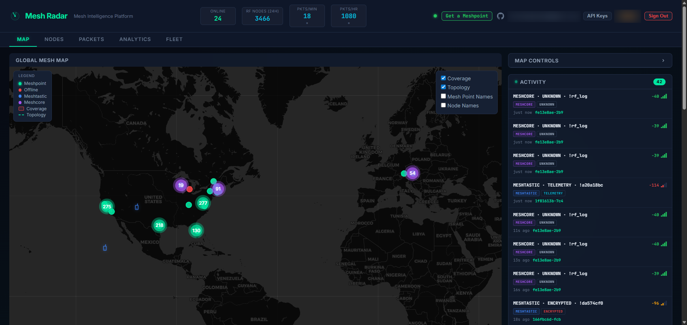

<p align="center">
  
</p>

<h1 align="center">Meshpoint</h1>

<p align="center"><strong>Open-source LoRa packet intelligence for Meshtastic and MeshCore mesh networks.</strong><br>Supports US915, EU868, ANZ915, IN865, KR920, and SG923 frequency regions.</p>

[](LICENSE)
[](https://www.python.org/)
[](https://www.raspberrypi.com/)
[](https://discord.gg/Cfuc6Cp4wM)
[](https://github.com/KMX415/meshpoint/stargazers)
[](https://github.com/KMX415/meshpoint/issues)
[](https://github.com/KMX415/meshpoint/commits/main)
[](docs/CHANGELOG.md)




---

## What Is This?

A Raspberry Pi-based LoRa listener that captures traffic from **Meshtastic** and **MeshCore** mesh networks simultaneously. The SX1302/SX1303 concentrator listens on **8 LoRa channels** across all spreading factors at once, while an optional MeshCore USB companion monitors MeshCore traffic on its own frequency.

Packets are captured, decrypted, stored locally, and shown on a real-time dashboard. Optionally, everything syncs upstream to [Meshradar](https://meshradar.io) for aggregated city-wide mesh intelligence.

### Standard Node vs Meshpoint

| | Standard Node | Meshpoint |
|---|---|---|
| **Channels** | 1 | 8 |
| **Demodulators** | 1 | 16 (multi-SF) |
| **Role** | Participant | Passive observer |
| **Packet visibility** | Own traffic | Everything in range |
| **Storage** | None | SQLite with retention |
| **Dashboard** | None | Real-time web UI |

---

## Features

**Dual-protocol capture.** Meshtastic and MeshCore traffic captured simultaneously. The SX1302 handles Meshtastic on 8 channels (SF7-SF12), while a USB MeshCore companion covers MeshCore on its own frequency.

**Full packet decoding.** 14 Meshtastic portnums decoded: TEXT, POSITION, NODEINFO, TELEMETRY, ROUTING, ADMIN, WAYPOINT, DETECTION_SENSOR, PAXCOUNTER, STORE_FORWARD, RANGE_TEST, TRACEROUTE, NEIGHBORINFO, and MAP_REPORT. 6 MeshCore message types decoded. Device roles (CLIENT, ROUTER, REPEATER, TRACKER, SENSOR) extracted from NodeInfo.

**Private channel decryption.** Configure your private channel PSKs and the Meshpoint decodes traffic on those channels alongside the default key. Supports any number of channels with AES-128 or AES-256 keys.

**6 frequency regions.** US, EU_868, ANZ, IN, KR, and SG_923. Select during setup and the concentrator auto-tunes. MeshCore companion radios configure to match automatically.

**Real-time dashboard.** Live map with node positions, color-coded packet feed with decoded payloads, traffic charts, signal analytics, and 24h active node counts. Accessible from any device on your network.

**Cloud integration.** Optional WebSocket uplink to [Meshradar](https://meshradar.io) for aggregated multi-site mesh intelligence. Fleet management, city-wide maps, and packet history across all your Meshpoints.

**Dual-protocol MQTT gateway.** Publish captured packets to community MQTT brokers and Home Assistant. Dual-protocol: Meshtastic (protobuf) and MeshCore (JSON) from a single device. Two-gate privacy model ensures private channel data never leaks. Optional JSON publishing, HA auto-discovery, and configurable location precision.

**Smart relay.** Optional re-broadcast of captured packets via a separate SX1262 radio. Deduplication, token-bucket rate limiting, RSSI-based signal filtering. TX path is independent from RX: transmission never blocks reception.

**Auto-detect hardware.** RAK Hotspot V2 and SenseCap M1 identified automatically during setup. MeshCore USB companions auto-detected on `/dev/ttyUSB*` and `/dev/ttyACM*`.

---

## Hardware

> **Requirements:** Raspberry Pi 4, 64-bit Raspberry Pi OS, Python 3.13. The compiled core modules are aarch64 binaries: other platforms (Pi 3, x86, 32-bit OS) are not currently supported.

### Option A: RAK Hotspot V2 (~$60, recommended)

The easiest path. RAK/MNTD Hotspot V2 miners (model **RAK7248**) include a Pi 4, RAK2287 (SX1302), Pi HAT, metal enclosure, antenna, and power supply: everything you need. Helium's IoT network didn't pan out, so these are all over eBay for $40-70.

[Find on eBay ($30-80)](https://www.ebay.com/sch/i.html?_nkw=RAK%20Hotspot%20V2%20%2F%20MNTD&_sacat=0&_from=R40&rt=nc&_udlo=30&_udhi=80)


Remove the 4 bottom screws to access the SD card slot. Flash a new card with Raspberry Pi OS 64-bit, run the install script, and you have a Meshpoint in a nice aluminum enclosure.

### Option B: SenseCap M1 (~$40-60)

Another Helium-era miner with identical compatibility. The SenseCap M1 includes a Pi 4, Seeed WM1303 concentrator (SX1303), carrier board, metal enclosure, and antenna. Some units ship with a 64GB SD card included.

[Find on eBay ($30-60)](https://www.ebay.com/sch/i.html?_nkw=SenseCap%20M1&_sacat=0&_from=R40&rt=nc&_udlo=30&_udhi=60)


Remove the 2 screws on the back panel (the side without the Ethernet/antenna ports) to access the SD card: it may be held in place by kapton tape. Flash with Raspberry Pi OS 64-bit and run the install script. USB-C power connects to the carrier board, not the Pi directly.

### Option C: Build Your Own (~$85)

| Component | Price |
|-----------|-------|
| Raspberry Pi 4 (1GB+) | $35 |
| RAK2287 SX1302 + Pi HAT | ~$20* |
| 915 MHz LoRa antenna | $10 |
| MicroSD card (16GB+) | $10 |
| USB-C power supply (5V 3A) | $10 |

*\*Helium's surplus means RAK2287 concentrators and Pi HATs go for ~$20 combined on eBay.*

**Assembly:** Seat the RAK2287 on the Pi HAT, mount the HAT on the Pi GPIO header, connect the antenna. Always connect the antenna before powering on.

### Optional: MeshCore USB Companion

Add a Heltec V3/V4 or T-Beam running [MeshCore USB companion firmware](https://flasher.meshcore.co.uk/) to monitor MeshCore traffic alongside Meshtastic. Plug it into any USB port on the Pi -- the setup wizard auto-detects the device and configures its radio frequency for your region.

> **Full step-by-step guide:** See the [Onboarding Guide](docs/ONBOARDING.md) for detailed instructions covering flashing, assembly, installation, MeshCore setup, and troubleshooting for all hardware options.

---

## Install

```bash
sudo apt update && sudo apt install -y git
sudo git clone https://github.com/KMX415/meshpoint.git /opt/meshpoint
cd /opt/meshpoint && sudo bash scripts/install.sh
```

This builds the SX1302 HAL with Meshtastic patches, sets up a Python venv, and installs the systemd service.

```bash
sudo meshpoint setup    # interactive config wizard
meshpoint status        # verify everything is running
```

Open `http://<pi-ip>:8080` for the local dashboard.

> **First time?** The [Onboarding Guide](docs/ONBOARDING.md) walks through everything from flashing the SD card to verifying your first captured packets.

---

## Architecture

```
                                ┌─────────────────────────┐
                                │    Meshradar Cloud       │
                                │    (meshradar.io)        │
                                └────────────┬────────────┘
                                             │ WebSocket
                                             │
┌──────────┐    ┌──────────┐    ┌────────────┴────────────┐
│Meshtastic│    │ SX1302/  │    │    Meshpoint (Pi 4)      │
│ packets  │───▶│ SX1303   │───▶│                          │
│ (OTA)    │    │ 8-ch RX  │    │  Capture → Decode → API  │
└──────────┘    └──────────┘    │              │           │
                                │           Dashboard     │
┌──────────┐    ┌──────────┐    │          (port 8080)    │
│ MeshCore │    │  Heltec  │    │                          │
│ packets  │───▶│  USB     │───▶│                          │
│ (OTA)    │    │companion │    │                          │
└──────────┘    └──────────┘    └─────────────────────────┘
```

---

## CLI

```bash
meshpoint status         # service status + config summary
meshpoint logs           # tail the service journal
meshpoint restart        # restart the service
meshpoint meshcore-radio # configure MeshCore companion radio frequency
sudo meshpoint setup     # re-run config wizard
```

---

## Local API

FastAPI server on port 8080:

| Endpoint | Description |
|----------|-------------|
| `GET /api/nodes` | All discovered nodes |
| `GET /api/nodes/map` | Nodes with GPS for map display |
| `GET /api/packets` | Recent packets (paginated) |
| `GET /api/analytics/traffic` | Traffic rates and counts |
| `GET /api/analytics/signal/rssi` | RSSI distribution |
| `GET /api/device/status` | Device health and uptime |
| `WS /ws` | Real-time packet stream |

---

## Updating

```bash
cd /opt/meshpoint && sudo git pull origin main && sudo systemctl restart meshpoint
```

The local dashboard shows an orange update indicator when a new version is available.

---

## Troubleshooting

**Chip version 0x00:** Concentrator not responding. Check that the concentrator module is seated, SPI is enabled (`raspi-config` → Interface Options → SPI), and try a full power cycle (unplug for 10+ seconds). Normal chip versions are `0x10` (SX1302) and `0x12` (SX1303).

**No packets:** Verify antenna is connected and frequency matches your region. Check `meshpoint logs` for `lgw_receive returned N packet(s)`.

**Upstream 401:** Bad API key. Get a free one at [meshradar.io](https://meshradar.io) and re-run `sudo meshpoint setup`.

---

## Documentation

- **[Onboarding Guide](docs/ONBOARDING.md):** step-by-step from empty Pi to running Meshpoint
- **[Configuration Guide](docs/CONFIGURATION.md):** all config options, private channels, relay, upstream, radio tuning
- **[Changelog](docs/CHANGELOG.md):** version history and release notes

---

## Community

- **Discord:** [discord.gg/Cfuc6Cp4wM](https://discord.gg/Cfuc6Cp4wM)
- **Website:** [meshradar.io](https://meshradar.io)
- **Issues:** [GitHub Issues](https://github.com/KMX415/meshpoint/issues)

---

## Contributing

Meshpoint is still early alpha. Pull requests are welcome, but please keep changes small and reviewable.

See [CONTRIBUTING.md](CONTRIBUTING.md) for guidelines, workflow, and PR expectations.

AI-assisted contributions are allowed, but contributors should review and understand all code before submitting.

---

## License

MIT: see [LICENSE](LICENSE). Compiled core modules are distributed separately under a commercial license.

---

*Built for the mesh community by [Meshradar](https://meshradar.io).*
