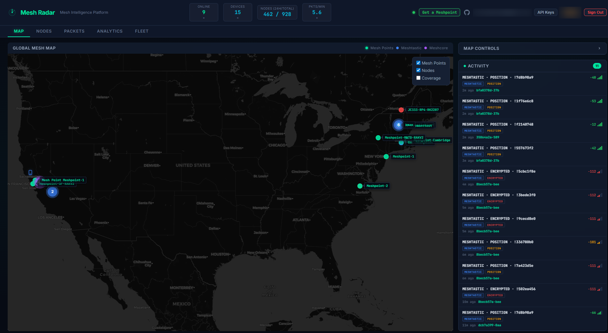
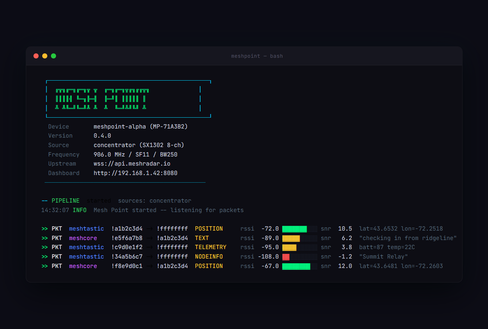

# Meshpoint

**Open-source LoRa packet intelligence for Meshtastic and Meshcore mesh networks.**

[](LICENSE)
[](https://www.python.org/)
[](https://www.raspberrypi.com/)
[](https://discord.gg/Cfuc6Cp4wM)





A Meshpoint is a Raspberry Pi with an SX1302 concentrator that listens on **8 LoRa channels simultaneously** and decodes everything it hears. It's not a node on the mesh -- it's a passive observer that sees all traffic across all spreading factors at once.

Packets are captured, decrypted, stored locally, and shown on a real-time dashboard. Optionally, everything syncs upstream to [Meshradar](https://meshradar.io) for aggregated city-wide mesh intelligence.

### Why not just use a regular node?

| | Regular Node | Meshpoint |
|---|---|---|
| **Channels** | 1 | 8 |
| **Demodulators** | 1 | 16 (multi-SF) |
| **Role** | Participant | Passive observer |
| **Packet visibility** | Own traffic | Everything in range |
| **Storage** | None | SQLite with retention |
| **Dashboard** | None | Real-time web UI |

---

## Get a Meshpoint Running

### Option A: RAK Hotspot V2 (~$60, recommended)

Retired Helium miners with everything you need: Pi 4, RAK2287, Pi HAT, antenna, metal enclosure, and power supply. Flash a fresh SD card and run the installer.

[Find on eBay ($30-80)](https://www.ebay.com/sch/i.html?_nkw=RAK%20Hotspot%20V2%20%2F%20MNTD&_sacat=0&_from=R40&rt=nc&_udlo=30&_udhi=80)


### Option B: SenseCap M1 (~$40-60)

Another Helium-era miner. Pi 4, WM1303 concentrator (SX1303), carrier board, antenna, enclosure. Auto-detected by the installer.

[Find on eBay ($30-60)](https://www.ebay.com/sch/i.html?_nkw=SenseCap%20M1&_sacat=0&_from=R40&rt=nc&_udlo=30&_udhi=60)


### Option C: Build your own (~$85)

| Component | Price |
|-----------|-------|
| Raspberry Pi 4 (1GB+) | $35 |
| RAK2287 SX1302 + Pi HAT | ~$20 |
| 915 MHz LoRa antenna | $10 |
| MicroSD card (16GB+) | $10 |
| USB-C power supply (5V 3A) | $10 |

> **Requirements:** Raspberry Pi 4, 64-bit Raspberry Pi OS, Python 3.13. The compiled core modules are aarch64 binaries -- other platforms are not currently supported.

> **Full setup guide:** [Onboarding Guide](docs/ONBOARDING.md)

---

## Install

```bash
sudo apt update && sudo apt install -y git
sudo git clone https://github.com/KMX415/meshpoint.git /opt/meshpoint
cd /opt/meshpoint && sudo bash scripts/install.sh
```

```bash
meshpoint setup    # interactive config wizard
meshpoint status   # verify everything is running
```

Open `http://<pi-ip>:8080` for the local dashboard.

---

## Architecture

```
                                ┌─────────────────────────┐
                                │    Meshradar Cloud       │
                                │    (meshradar.io)        │
                                └────────────┬────────────┘
                                             │ WebSocket
                                             │
┌──────────┐    ┌──────────┐    ┌────────────┴────────────┐
│  LoRa    │    │ SX1302/  │    │    Meshpoint (Pi 4)      │
│ Packets  │───▶│ SX1303   │───▶│                          │
│ (OTA)    │    │ 8-ch RX  │    │  Capture → Decode → API  │
└──────────┘    └──────────┘    │              │           │
                                │           Dashboard     │
                                │          (port 8080)    │
                                └─────────────────────────┘
```

**Capture** — SX1302 HAL receives on 8 channels across SF7-SF12 simultaneously.

**Decode** — Packets decrypted and parsed. Positions, text, telemetry, node info, routing -- all extracted and stored.

**Dashboard** — Local web UI with a live map, packet feed, traffic charts, and signal analytics.

**Upstream** — Optional WebSocket connection to Meshradar for multi-site aggregated intelligence.

---

## Configuration

All settings live in `config/default.yaml` with user overrides in `config/local.yaml`.

```yaml
radio:
  frequency_mhz: 906.875
  spreading_factor: 11
  bandwidth_khz: 250.0

capture:
  sources:
    - concentrator

relay:
  enabled: false

upstream:
  enabled: true
  url: "wss://api.meshradar.io/ws"
```

---

## Local API

FastAPI server on port 8080:

| Endpoint | Description |
|----------|-------------|
| `GET /api/nodes` | All discovered nodes |
| `GET /api/nodes/map` | Nodes with GPS for map display |
| `GET /api/packets` | Recent packets (paginated) |
| `GET /api/analytics/traffic` | Traffic rates and counts |
| `GET /api/analytics/signal/rssi` | RSSI distribution |
| `GET /api/device/status` | Device health and uptime |
| `WS /ws` | Real-time packet stream |

---

## CLI

```bash
meshpoint status     # service status + config summary
meshpoint logs       # tail the service journal
meshpoint restart    # restart the service
meshpoint setup      # re-run config wizard
```

---

## Smart Relay (Optional)

Connect a separate SX1262 radio (T-Beam, Heltec, RAK4631) via USB and the Meshpoint can re-broadcast packets it hears with deduplication, rate limiting, and signal filtering. TX is independent from RX -- transmission never blocks reception.

---

## Troubleshooting

**Chip version 0x00** — Concentrator not responding. Check that the module is seated, SPI is enabled, and try a full power cycle (unplug for 10+ seconds).

**No packets** — Verify antenna is connected and frequency matches your region. Check `meshpoint logs` for `lgw_receive returned N packet(s)`.

**Upstream 401** — Bad API key. Get a free one at [meshradar.io](https://meshradar.io) and re-run `meshpoint setup`.

---

## Community

- **Discord:** [discord.gg/Cfuc6Cp4wM](https://discord.gg/Cfuc6Cp4wM)
- **Website:** [meshradar.io](https://meshradar.io)
- **Issues:** [GitHub Issues](https://github.com/KMX415/meshpoint/issues)

---

## Contributing

The API server, dashboard, analytics, storage, and relay modules are fully open source. Protocol decoding and hardware abstraction are distributed as compiled modules.

Fork → branch → PR. Bug reports and feature requests welcome as issues.

---

## License

MIT — see [LICENSE](LICENSE). Compiled core modules are distributed separately under a commercial license.
